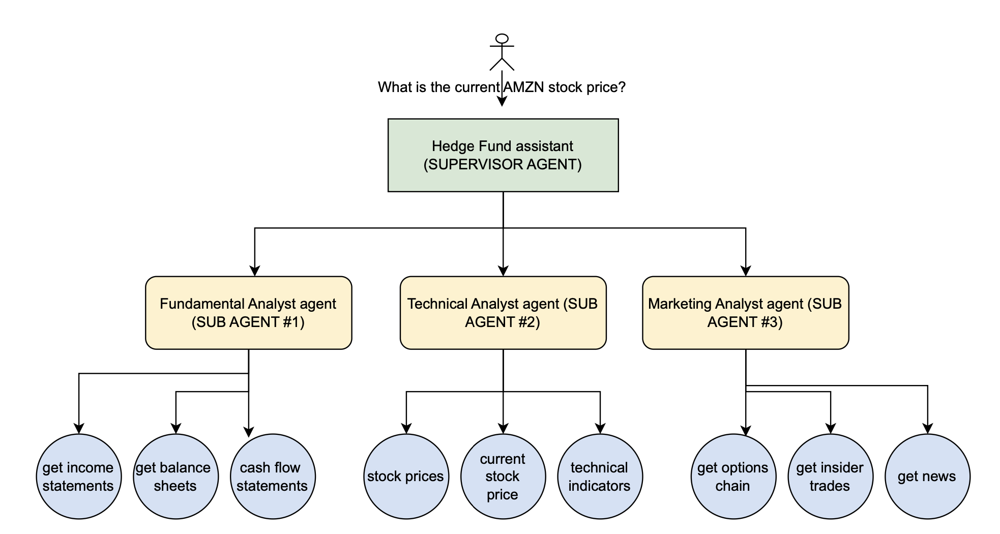
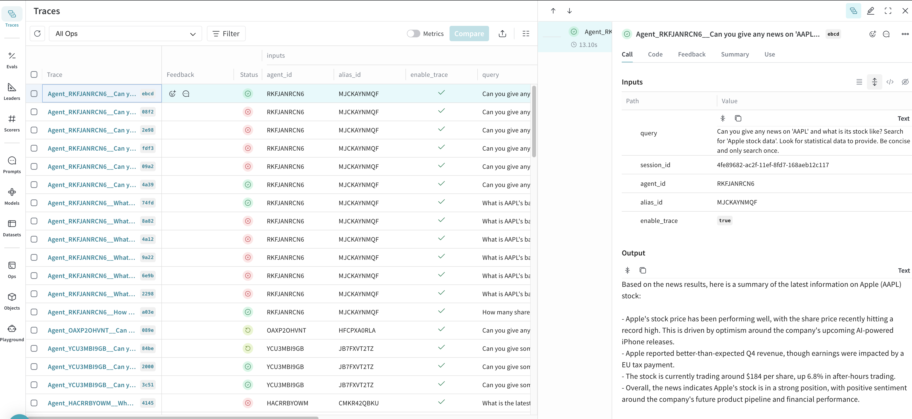

# Multi-Agent Collaboration (MAC) Example: Hedge Fund Assistant

## Introduction to Multi-Agent Collaboration
With Multi-Agent Collaboration, you can build, deploy, and manage multiple AI agents working together on complex multi-step tasks that require specialized skills.

When you need more than a single agent to handle a complex task, you can create additional specialized agents to address different aspects of the process. However, managing these agents becomes technically challenging as tasks grow in complexity. As a developer using open source solutions, you may find yourself navigating the complexities of agent orchestration, session handling, memory management, and other technical aspects that require manual implementation.

With the fully managed multi-agent collaboration capability on Amazon Bedrock, specialized agents work within their domains of expertise, coordinated by a supervisor agent. The supervisor breaks down requests, delegates tasks, and consolidates outputs into a final response. For example, an investment advisory multi-agent system might include agents specialized in financial data analysis, research, forecasting, and investment recommendations. Similarly, a retail operations multi-agent system could handle demand forecasting, inventory allocation, supply chain coordination, and pricing optimization.

This example demonstrates a **Hedge Fund Assistant** using MAC principles with the following structure:
- A **Supervisor Agent** powered by the `Amazon Nova Lite` foundation model routes user queries.
- Three **Sub-Agents**: 
  - **Fundamental Analyst Agent** (uses `Claude 3 Haiku` as the FM)
  - **Technical Analyst Agent** (uses `Amazon Nova Lite` as the FM)
  - **Market Analyst Agent** (uses `Claude 3 Haiku` as the FM)
- Each sub-agent has access to a set of tools to fetch data, analyze it, and provide actionable insights.

**Note**: In this example, we diversify the models across various sub agents based on the tasks that they need to perform as follows:

  - The supervisor agent is responsible for delegating complex tasks into sub steps to the sub agents, so we power it with the newest `Amazon Nova Lite` model on Amazon Bedrock. Amazon Nova Lite is a very low-cost multimodal model that is lightning fast for processing image, video, and text inputs. The accuracy of Amazon Nova Lite across a breadth of tasks, coupled with its lightning-fast speed.

  - We power the `Fundamental Analyst Agent` and the `Market Analyst Agent` with `Claude 3 Haiku` to increase speed and get optimal performance on the responses. These sub agents call external APIs to fetch information to the user.

  - Lastly, the `Technical Analyst Agent` is powered by `Amazon Nova Lite`. Since this sub agent is responsible for more complex tasks as compared to the two sub agents, we use Nova Lite to get high quality responses on technical questions.



## Agent invocation tracking

To enhance our multi-agent collaboration system, we've integrated Weave for comprehensive tracking of agent invocations. Weave allows us to monitor and analyze the performance of our supervisor agent and other agent calls in real-time. This integration provides valuable insights into the frequency, duration, and outcomes of agent interactions, helping us optimize the collaboration process.

To set up Weave tracking, you'll need to add your `WEAVE_API_KEY` to the `.env` file in the project root. Once configured, Weave will automatically track each agent invocation, including the supervisor agent's decisions and the subsequent calls to specialized agents.

Here's an example of what the Weave tracking dashboard looks like for our multi-agent system:



This visualization helps us understand the flow of information between agents, identify potential bottlenecks, and assess the overall efficiency of our collaborative AI system.

---

## Overview of the Hedge Fund Assistant Example
This example creates a supervisor agent and integrates the three sub-agents, each having specific tools for financial data analysis:
1. **Fundamental Analyst Agent**:
   - Tools: Retrieve income statements, balance sheets, and cash flow statements.
2. **Technical Analyst Agent**:
   - Tools: Fetch stock prices, current prices, and compute technical indicators (e.g., RSI, MACD, SMA).
3. **Market Analyst Agent**:
   - Tools: Access options chain data, insider trading information, and market news.

The workflow includes:
1. Setting up the `.env` file with required API keys.
2. Running all notebooks to initialize the agents and integrate them into the supervisor agent.
3. Using the `SUPERVISOR_ROUTER` collaboration mode to classify user intents and route queries efficiently.

---

## Prerequisites
1. Clone this repository.
    ```.bash
    git clone https://github.com/madhurprash/hedge-fund-multi-agent-collaboration.git
    ```
1. Set Up API Keys - Create a [`.env`](.env) file in the root directory or modify the existing one with the following content (these API keys are used to fetch financial data, crawl the web and track agent actions from external sites such as Weave and Travily). You can create accounts and generate your API keys here: [financial datasets](https://financialdatasets.ai), [tavily](https://tavily.com) and [weave](https://wandb.ai/site/weave/).
    ```env
    WEAVE_API_KEY=<your_weave_api_key>
    TRAVILY_API_KEY=<your_travily_api_key>
    FINANCIAL_DATASET_API=<your_financial_dataset_api_key>
    ```
1. Run all notebooks in the following order that creates the sub agents and then finally the supervisor agent to intelligently route respective requests. Run the following notebooks in a `conda_python3` environment. All instructions and additional notes are given in the respective notebooks:
    ```
    0_fundamental_analyst_agent
      |
      |-- 1_technical_analyst_agent
      |       |
      |       |-- 2_market_analyst_agent
      |               |
      |               |-- 3_multi_agent_collaboration
    ```


## Tools Available to Each Sub-Agent

1. Market Analyst Agent Tools
   
- `get_options_chain`: Retrieve options chain data for a ticker.
- `get_insider_trades`: Fetch insider trading information for a ticker.
- `get_news`: Fetch the latest market news and analysis.

2. Technical Analyst Agent Tools

- `get_stock_prices`: Retrieve historical stock prices for a ticker.
- `get_current_stock_price`: Fetch the latest stock price for a ticker.
- `get_technical_indicators`: Compute technical indicators (e.g., RSI, MACD, SMA, etc.) for a ticker.

3. Fundamental Analyst Agent Tools

- `get_income_statements`: Retrieve income statements for a company.
- `get_balance_sheets`: Fetch balance sheets for a company.
- `get_cash_flow_statements`: Access cash flow statements for a company.

## Security

See [CONTRIBUTING](CONTRIBUTING.md#security-issue-notifications) for more information.

## License

This library is licensed under the MIT-0 License. See the LICENSE file.


